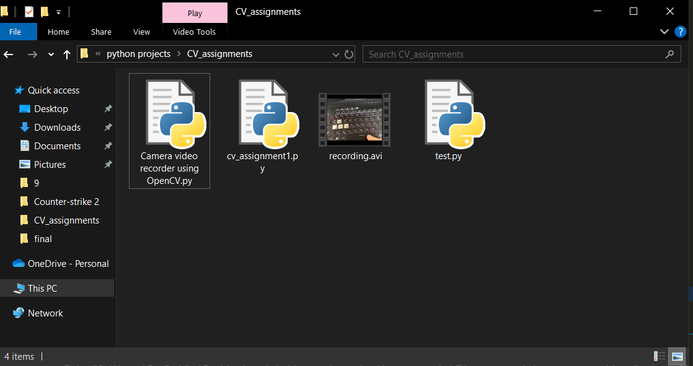

# Simple Video Recorder #
This assignment's aim is to create a simple video recorder using Open CV in python. 
## How to use ##
After executing this program, There are 3 modes to this. 
1. Preview mode which just shows you how the camera looks.
2. Recording mode which can accessed through clicking space button.
3. Inverted mode that can show inverted video of what is camera looking at by pressing i or I.

These 3 modes are organized through keyboard input.

