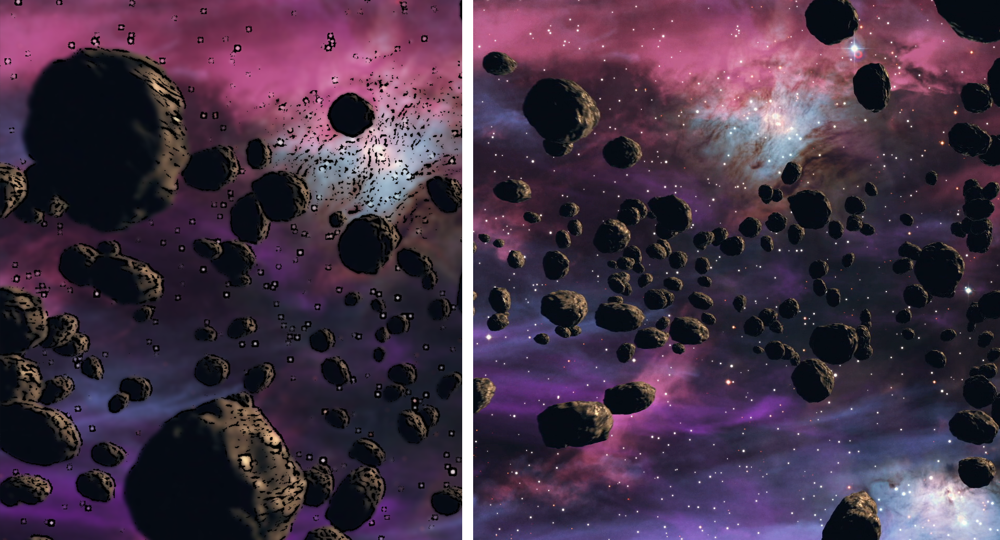

#VideoToCartoonConverter
## Overview
VideoToCartoonConverter is a simple Python code that converts a video into a cartoonish one. 
This code uses OpenCv library to process each frame of the input to achieve cartoonish effect. 

1. Place the input video fiile in same directory.
2. Run the code.
3. Window titled Cartoom will appear.
4. Press 'Esc' to close the window and exit the script.

## Possible improvments
- Reduce the frame size or skip frame to reduce process delay

## Example 

